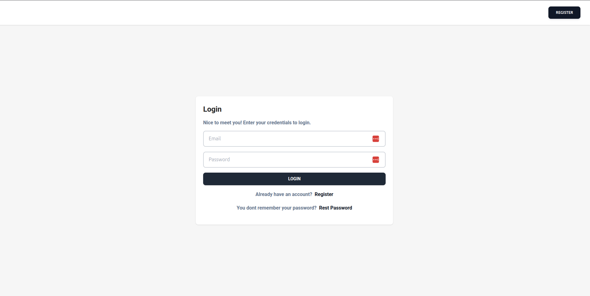
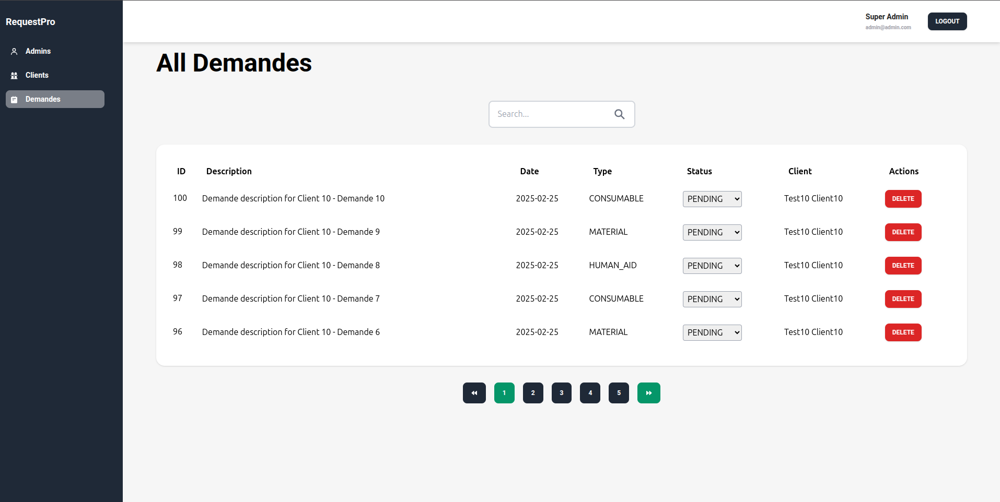
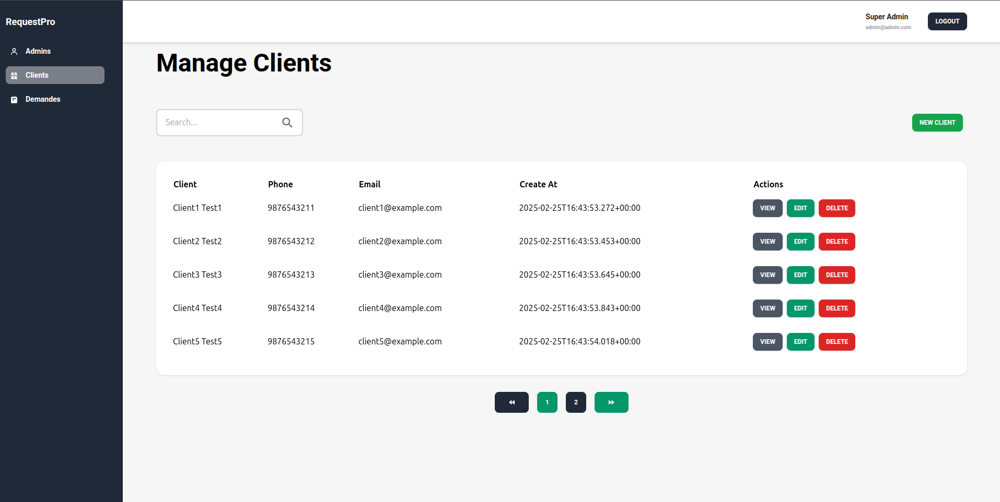

# Request Pro

## 📋 Table of Contents
- [📖 Project Overview](#-project-overview)  
- [🚀 Quick Start](#-quick-start)  
- [🔧 Requirements](#-requirements)  
- [📂 Project Structure](#-project-structure)  
- [📸 Demo](#-demo)  
- [🔐 License](#-license)  
- [📞 Contact](#-contact)  

---

## 📖 Project Overview

Request Pro is a **PFA School project** designed to create a system for managing resource requests inside an enterprise. This project provides an efficient solution for handling human resources and material requests, streamlining internal company processes.  

The project is built with:
- **Backend:** Spring Boot, Spring Security, Java  
- **Frontend:** React, Vite, JavaScript  
- **Mobile:** React Native (currently under maintenance)  
- **Database:** MySQL  
- **Containerization:** Docker  
- **Deployment:** DigitalOcean, orchestrated with Docker Swarm  

---

## ✨ Features

- 🧑‍💼 Manage Clients  
- 📄 Manage Requests (Demandes)  
- 🔐 Password Reset and Authentication (Spring Security with JWT)  
- 🌐 Fully Dockerized Environment  
- 📱 Mobile Application (under maintenance)  

---

## 🚀 Quick Start

Follow these steps to quickly set up and run the project:

1. **Clone the repository**:
   ```bash
   git clone https://github.com/marouanedbibih/request-pro.git
   cd request-pro
   ```

2. **Start Docker Environment**:
   Navigate to the `docker/` folder and run the script:
   ```bash
   bash dev.sh
   ```

3. **Backend Setup**:
   - Go to the `backend/` directory and install the dependencies:
     ```bash
     ./mvnw install
     ```
   - Start the backend service:
     ```bash
     ./mvnw spring-boot:run
     ```

4. **Frontend Setup**:
   - Navigate to `frontend/` and install dependencies:
     ```bash
     npm install
     ```
   - Start the frontend:
     ```bash
     npm run dev
     ```

5. **Access the Application**:
   - Frontend: [http://localhost:3000](http://localhost:3000)  
   - API: [http://localhost:8084](http://localhost:8084)  

---

## 🔧 Requirements

| Dependency              | Description                                      |
|-------------------------|--------------------------------------------------|
| **Node.js**             | Required for the frontend. [Node.js website](https://nodejs.org) |
| **Java 21**             | Required for the backend. [OpenJDK website](https://openjdk.java.net) |
| **Docker & Docker Swarm**| For containerization and deployment. [Docker website](https://www.docker.com/get-started) |
| **MySQL**               | Database for storing application data.           |

---

## 📂 Project Structure

```
request-pro/
├── backend/            # Spring Boot backend service
│   ├── src/            # Application source code
│   ├── pom.xml         # Maven configurations
│
├── frontend/           # React.js frontend service
│   ├── src/            # Frontend source code
│   ├── package.json    # Node.js dependencies
│
├── mobile/             # React Native mobile application (under maintenance)
│
├── docker/             # Docker configurations
│   ├── compose.yml     # Base Docker Compose file
│   ├── Dockerfile.backend  # Backend Dockerfile
│   ├── Dockerfile.frontend # Frontend Dockerfile
│
├── docs/               # Documentation and images
│   ├── images/         # Screenshots and visual resources
│
├── LICENSE             # License file
├── README.md           # Project documentation
```

---

## 📸 Demo

Explore the application through the following links:

- **Frontend**: [http://request-pro.marouanedbibih.engineer](http://request-pro.marouanedbibih.engineer)  
- **Backend API**: [http://api.request-pro.marouanedbibih.engineer](http://api.request-pro.marouanedbibih.engineer)  

### Screenshots

1. **Login Page**  
   User authentication interface  
     

2. **Requests Management**  
   Manage and track resource requests  
     

3. **Client Management**  
   Add and edit client information  
     

---

## 🔐 License

This project is licensed under the [MIT License](LICENSE).

---

## 📞 Contact

📧 **Marouane Dbibih** – [m.dbibih@gmail.com](mailto:m.dbibih@gmail.com)

🌐 **Portfolio** – [marouanedbibih.engineer](http://marouanedbibih.engineer)

